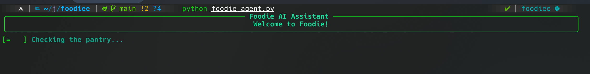
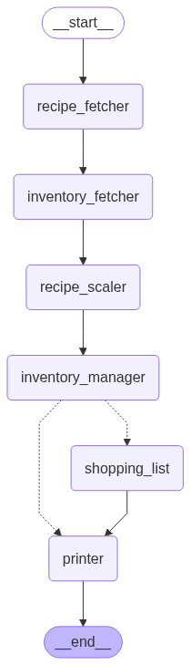
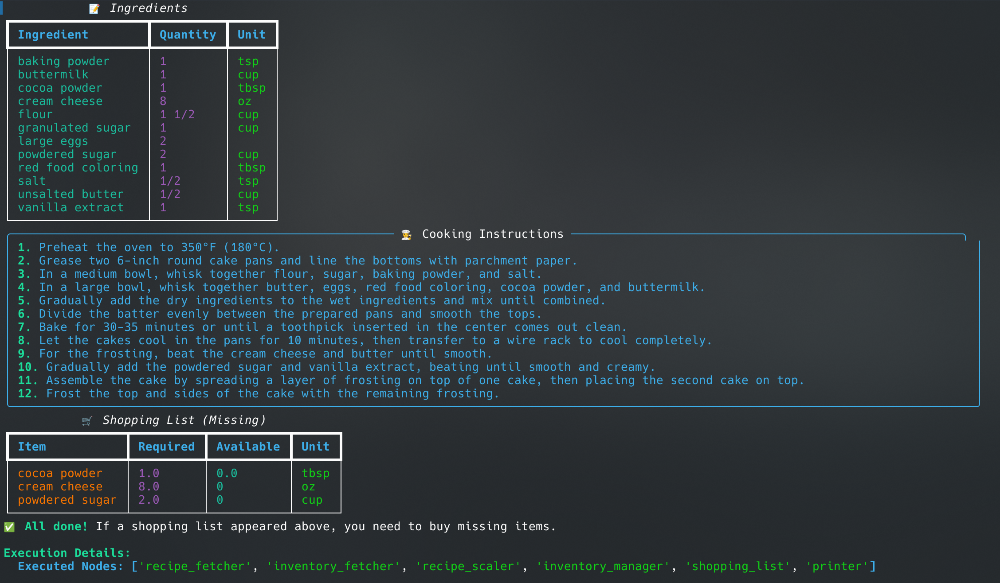

# Foodie - The AI Cooking Assistant



Foodie is an intelligent cooking assistant that helps you prepare your favorite dishes with the ingredients you have on hand. Simply tell Foodie what you want to cook and for how many people, and it will find a recipe, check your inventory, and generate a shopping list for any missing items.

## Key Features

- **Interactive CLI:** A user-friendly command-line interface with engaging animations and prompts.
- **Smart Recipe Retrieval:** Finds the best recipes online using DuckDuckGo Search.
- **Inventory Management:** Keeps track of your available ingredients and updates them after each meal.
- **Automated Shopping Lists:** Generates a shopping list for any ingredients you don't have.
- **Recipe Scaling:** Automatically adjusts ingredient quantities based on the number of servings.
- **Reliable Quality:** It has been thoroughly evaluated with the help of Judgeval's eval and tracer to ensure best working AI Agent.

## Technical Deep Dive

### Architecture

Foodie is built on a stateful graph architecture powered by **LangGraph**. This allows for a modular and maintainable workflow, where each step in the cooking process is represented as a node in the graph. The state is passed between nodes, enabling complex, conditional logic.



### Data Storage

For this indie version of Foodie, I am using simple `JSON` files for inventory and shopping list management. This approach is lightweight and easy to manage for a small-scale project. In a production environment, this would be replaced with a more robust database solution like PostgreSQL or MongoDB to handle larger datasets and more complex queries.

## Getting Started

### Prerequisites

- Python 3.8+
- Pip

### Installation

1.  **Clone the repository:**

    ```bash
    git clone https://github.com/your-username/foodie.git
    cd foodie
    ```

2.  **Create and activate a virtual environment:**

    ```bash
    python -m venv env
    source env/bin/activate
    ```

3.  **Install the dependencies:**

    ```bash
    pip install -r requirements.txt
    ```

4.  **Set up your environment variables:**

    Create a `.env` file in the root directory and add the following, replacing the placeholder values with your actual API keys:

    ```env
    # Judgment Keys
    JUDGMENT_API_KEY=the_api_key
    JUDGMENT_ORG_ID=the_org_id
    PROJECT_NAME=foodiee
    # Groq Client Key
    GROQ_API_KEY=your_groq_key
    ```

### Usage

To start the Foodie AI Assistant, run the following command:

```bash
python foodie_agent.py
```



## A Special Thanks to Judgeval

This project was made possible with the help of **Judgeval**, an open-source library by **Judgement Lab** for testing and evaluating AI agents. Judgeval's powerful tracing and evaluation tools were instrumental in debugging the agent and ensuring its reliability. The ability to visualize the agent's execution flow and inspect the inputs and outputs of each node saved countless hours of development time.

If you are building AI agents, we highly recommend checking out [Judgeval](https://github.com/JudgmentLabs/judgeval).

## Contributing

Contributions are welcome! Please feel free to submit a pull request or open an issue to discuss any changes.

## License

This project is licensed under the MIT License. See the [LICENSE](LICENSE) file for details.